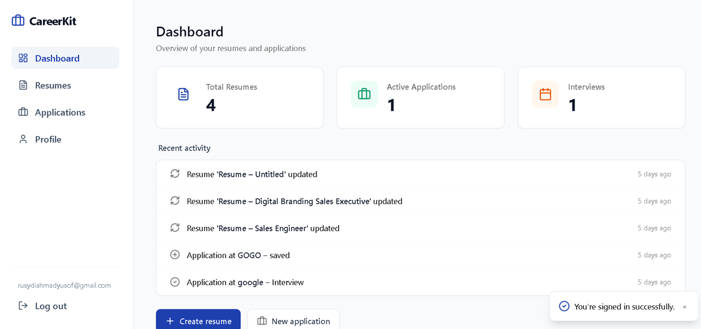

# CareerKit

Build resumes and track job applications in one place.

## Screenshot


## Stack

- **Next.js 15** (App Router), **TypeScript**, **Tailwind CSS**
- **Supabase** (Auth, Postgres) — configure via env

## Run locally

1. Copy env:
   - Windows (PowerShell): `Copy-Item .env.example .env`
   - macOS/Linux: `cp .env.example .env`
2. Fill in Supabase values in `.env` (from [Supabase dashboard](https://supabase.com/dashboard)).
3. Install and run:

```bash
npm install
npm run dev
```

Open [http://localhost:3000](http://localhost:3000).

## Supabase setup (migrations)

For a fresh Supabase database, run the combined SQL once from `supabase/migrations/`:

1. `careerkit_fresh.sql`

Use either the Supabase Dashboard SQL editor or your Supabase CLI workflow.

## Env vars

| Variable                        | Required | Description                                              |
| ------------------------------- | -------- | -------------------------------------------------------- |
| `NEXT_PUBLIC_SUPABASE_URL`      | Yes      | Supabase project URL                                     |
| `NEXT_PUBLIC_SUPABASE_ANON_KEY` | Yes      | Supabase anon/public key                                 |
| `GROQ_API_KEY`                  | No       | For tailor-to-job and ATS scoring (AI). Prefer Groq.      |
| `OPENAI_API_KEY`                | No       | Alternative for tailor/ATS if Groq is not set.           |
| `SUPABASE_SERVICE_ROLE_KEY`     | No       | Needed for account deletion (server-side auth delete).   |

## Password reset (forgot password)

In the [Supabase Dashboard](https://supabase.com/dashboard) → Authentication → URL Configuration, add your app URL to **Redirect URLs** (e.g. `https://yourapp.com/reset-password` and `http://localhost:3000/reset-password` for local testing). Otherwise the email reset link will not open your app.

## Deploy

Connect this repo to [Vercel](https://vercel.com); set the env vars in the project settings. Deploys on push to `main`.

## Docs

Product and planning docs are in `docs/` (see `docs/README.md`). The `docs/` folder is not tracked in git.
